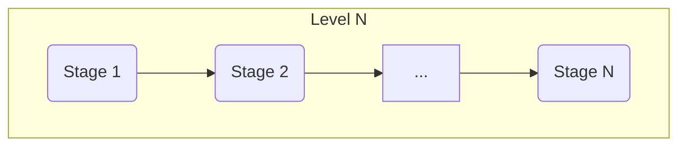

# NodeJS My Dojo Challenges

There's a branch per level, each level could have multiple stages, the current structure looks like this:

Stages are just incremental features inside the same challenge.

## How to deliver the challenges

1. Branch off from the level you want to be assessed.
   The branch name should be formmated like this:

   `nodejs-[LEVEL]-[STAGE]-CognizantID`

   Where `LEVEL` could have the following values:
   - level1
   - level2
   - level3
   - level4

   And `STAGE` could have these values:
   - stage1
   - stage2
   - stageN ...

   for example, the employee with CognizantID 999999, who wants to get the 
   level 2 and is going to deliver the stage 3, has to create a branch like this:

   >`nodejs-level2-stage3-999999`

2. Create a **Pull Request** from the corresponding link, _they are using the example branch, search your own_:

||Stages
|--|--|
|**Level 1**|[Stage1](https://github.com/DX-and-EE-South-Europe/node-challenges/compare/level1...nodejs-level1-stage1-999999?quick_pull=1&labels=nodejs,level-1&title=Level+2++Stage++1++999999&template=level1.md), [Stage2](https://github.com/DX-and-EE-South-Europe/node-challenges/compare/level1...nodejs-level1-stage2-999999?quick_pull=1&labels=nodejs,level-1&title=Level+2++Stage++2++999999&template=level1.md), [Stage 3](https://github.com/DX-and-EE-South-Europe/node-challenges/compare/level1...nodejs-level1-stage3-999999?quick_pull=1&labels=nodejs,level-1&title=Level+2++Stage++3++999999&template=level1.md), [Stage 4](https://github.com/DX-and-EE-South-Europe/node-challenges/compare/level1...nodejs-level1-stage4-999999?quick_pull=1&labels=nodejs,level-1&title=Level+2++Stage++4++999999&template=level1.md)|
|**Level 2**|[Stage1](https://github.com/DX-and-EE-South-Europe/node-challenges/compare/level2...nodejs-level2-stage1-999999?quick_pull=1&labels=nodejs,level-2&title=Level+2++Stage++1++999999&template=level2.md), [Stage2](https://github.com/DX-and-EE-South-Europe/node-challenges/compare/level2...nodejs-level2-stage2-999999?quick_pull=1&labels=nodejs,level-2&title=Level+2++Stage++2++999999&template=level2.md), [Stage 3](https://github.com/DX-and-EE-South-Europe/node-challenges/compare/level2...nodejs-level2-stage3-999999?quick_pull=1&labels=nodejs,level-2&title=Level+2++Stage++3++999999&template=level2.md), [Stage 4](https://github.com/DX-and-EE-South-Europe/node-challenges/compare/level2...nodejs-level2-stage4-999999?quick_pull=1&labels=nodejs,level-2&title=Level+2++Stage++4++999999&template=level2.md)|
|**Level 3**|[Stage1](https://github.com/DX-and-EE-South-Europe/node-challenges/compare/level2...nodejs-level3-stage1-999999?quick_pull=1&labels=nodejs,level-3&title=Level+3++Stage++1++999999&template=level3.md), [Stage2](https://github.com/DX-and-EE-South-Europe/node-challenges/compare/level3...nodejs-level3-stage2-999999?quick_pull=1&labels=nodejs,level-3&title=Level+3++Stage++2++999999&template=level2.md), [Stage 3](https://github.com/DX-and-EE-South-Europe/node-challenges/compare/level3...nodejs-level3-stage3-999999?quick_pull=1&labels=nodejs,level-3&title=Level+3++Stage++3++999999&template=level3.md), [Stage 4](https://github.com/DX-and-EE-South-Europe/node-challenges/compare/level3...nodejs-level3-stage4-999999?quick_pull=1&labels=nodejs,level-3&title=Level+3++Stage++4++999999&template=level3.md)|
|**Level 4**|[Stage1](https://github.com/DX-and-EE-South-Europe/node-challenges/compare/level4...nodejs-level4-stage1-999999?quick_pull=1&labels=nodejs,level-4&title=Level+4++Stage++1++999999&template=level4.md), [Stage2](https://github.com/DX-and-EE-South-Europe/node-challenges/compare/level4...nodejs-level4-stage2-999999?quick_pull=1&labels=nodejs,level-4&title=Level+4++Stage++2++999999&template=level4.md), [Stage 3](https://github.com/DX-and-EE-South-Europe/node-challenges/compare/level4...nodejs-level4-stage3-999999?quick_pull=1&labels=nodejs,level-4&title=Level+4++Stage++3++999999&template=level4.md), [Stage 4](https://github.com/DX-and-EE-South-Europe/node-challenges/compare/level4...nodejs-level4-stage4-999999?quick_pull=1&labels=nodejs,level-4&title=Level+4++Stage++4++999999&template=level4.md)
